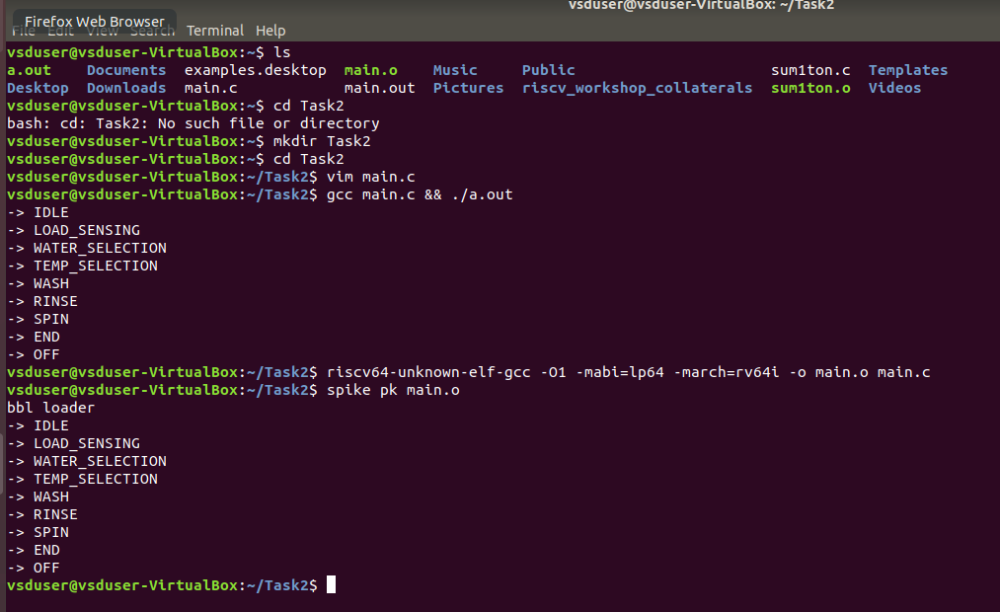

## Task 3: SPIKE Sim 

Updated code with testbench: [main.c](./main.c). 

Main changes: 
```c
void print_state(State state) {
    switch (state) {
        case OFF:
            printf("-> OFF\n");
            break;
        case IDLE:
            printf("-> IDLE\n");
            break;
        case LOAD_SENSING:
            printf("-> LOAD_SENSING\n");
            break;
        case WATER_SELECTION:
            printf("-> WATER_SELECTION\n");
            break;
        case TEMP_SELECTION:
            printf("-> TEMP_SELECTION\n");
            break;
        case WASH:
            printf("-> WASH\n");
            break;
        case RINSE:
            printf("-> RINSE\n");
            break;
        case SPIN:
            printf("-> SPIN\n");
            break;
        case END:
            printf("-> END\n");
            break;
        default:
            printf("-> FAILED!\n");
            break;
    }
}

void test_state_machine() {
    State current_state = OFF;

    Event events[] = {
        POWER_BUTTON, START_PAUSE_BUTTON, CYCLE_SELECTION, 
        WATER_LEVEL_SELECTION, TEMP_SELECTION_EVENT, CYCLE_COMPLETE
    };

    for (int i = 0; i < sizeof(events)/sizeof(events[0]); ++i) {
        current_state = state_machine(current_state, events[i]);
        print_state(current_state);
    }

    while (current_state != END) {
        current_state = state_machine(current_state, CYCLE_COMPLETE);
        print_state(current_state);
    }

    current_state = state_machine(current_state, POWER_BUTTON);
    print_state(current_state);
}
```

Outputs from C language GCC and RISC-V GCC:


We can clearly see that both the outputs are same.

OBJDumps: 
* O1: [dmp](o1.out)
```
00000000000102f0 <test_state_machine>:
   102f0:	fc010113          	addi	sp,sp,-64
   102f4:	02113c23          	sd	ra,56(sp)
   102f8:	02813823          	sd	s0,48(sp)
   102fc:	02913423          	sd	s1,40(sp)
   10300:	03213023          	sd	s2,32(sp)
   10304:	00012423          	sw	zero,8(sp)
   10308:	00100793          	li	a5,1
   1030c:	00f12623          	sw	a5,12(sp)
   10310:	00200793          	li	a5,2
   10314:	00f12823          	sw	a5,16(sp)
   10318:	00300793          	li	a5,3
   1031c:	00f12a23          	sw	a5,20(sp)
   10320:	00400793          	li	a5,4
   10324:	00f12c23          	sw	a5,24(sp)
   10328:	00500793          	li	a5,5
   1032c:	00f12e23          	sw	a5,28(sp)
   10330:	00810493          	addi	s1,sp,8
   10334:	02010913          	addi	s2,sp,32
   10338:	00000413          	li	s0,0
   1033c:	0004a583          	lw	a1,0(s1)
   10340:	00040513          	mv	a0,s0
   10344:	e41ff0ef          	jal	ra,10184 <state_machine>
   10348:	0005041b          	sext.w	s0,a0
   1034c:	00040513          	mv	a0,s0
   10350:	ed1ff0ef          	jal	ra,10220 <print_state>
   10354:	00448493          	addi	s1,s1,4
   10358:	fe9912e3          	bne	s2,s1,1033c <test_state_machine+0x4c>
   1035c:	00800793          	li	a5,8
   10360:	02f40263          	beq	s0,a5,10384 <test_state_machine+0x94>
   10364:	00800493          	li	s1,8
   10368:	00500593          	li	a1,5
   1036c:	00040513          	mv	a0,s0
   10370:	e15ff0ef          	jal	ra,10184 <state_machine>
   10374:	0005041b          	sext.w	s0,a0
   10378:	00040513          	mv	a0,s0
   1037c:	ea5ff0ef          	jal	ra,10220 <print_state>
   10380:	fe9414e3          	bne	s0,s1,10368 <test_state_machine+0x78>
   10384:	00000593          	li	a1,0
   10388:	00040513          	mv	a0,s0
   1038c:	df9ff0ef          	jal	ra,10184 <state_machine>
   10390:	0005051b          	sext.w	a0,a0
   10394:	e8dff0ef          	jal	ra,10220 <print_state>
   10398:	03813083          	ld	ra,56(sp)
   1039c:	03013403          	ld	s0,48(sp)
   103a0:	02813483          	ld	s1,40(sp)
   103a4:	02013903          	ld	s2,32(sp)
   103a8:	04010113          	addi	sp,sp,64
   103ac:	00008067          	ret

00000000000103b0 <main>:
   103b0:	ff010113          	addi	sp,sp,-16
   103b4:	00113423          	sd	ra,8(sp)
   103b8:	f39ff0ef          	jal	ra,102f0 <test_state_machine>
   103bc:	00000513          	li	a0,0
   103c0:	00813083          	ld	ra,8(sp)
   103c4:	01010113          	addi	sp,sp,16
   103c8:	00008067          	ret
```

* Ofast: [dmp](./ofast.out)

```
00000000000102d4 <test_state_machine>:
   102d4:	00300713          	li	a4,3
   102d8:	00500793          	li	a5,5
   102dc:	00100693          	li	a3,1
   102e0:	02071713          	slli	a4,a4,0x20
   102e4:	02079793          	slli	a5,a5,0x20
   102e8:	fb010113          	addi	sp,sp,-80
   102ec:	02069693          	slli	a3,a3,0x20
   102f0:	00270713          	addi	a4,a4,2
   102f4:	00478793          	addi	a5,a5,4
   102f8:	04813023          	sd	s0,64(sp)
   102fc:	02913c23          	sd	s1,56(sp)
   10300:	03213823          	sd	s2,48(sp)
   10304:	03313423          	sd	s3,40(sp)
   10308:	03413023          	sd	s4,32(sp)
   1030c:	04113423          	sd	ra,72(sp)
   10310:	00d13423          	sd	a3,8(sp)
   10314:	00e13823          	sd	a4,16(sp)
   10318:	00f13c23          	sd	a5,24(sp)
   1031c:	00810493          	addi	s1,sp,8
   10320:	00000413          	li	s0,0
   10324:	00014937          	lui	s2,0x14
   10328:	00600a13          	li	s4,6
   1032c:	00100993          	li	s3,1
   10330:	0100006f          	j	10340 <test_state_machine+0x6c>
   10334:	0004a703          	lw	a4,0(s1)
   10338:	03370863          	beq	a4,s3,10368 <test_state_machine+0x94>
   1033c:	00078413          	mv	s0,a5
   10340:	a7090513          	addi	a0,s2,-1424 # 13a70 <__moddi3+0x8c>
   10344:	380000ef          	jal	ra,106c4 <puts>
   10348:	0014079b          	addiw	a5,s0,1
   1034c:	00448493          	addi	s1,s1,4
   10350:	ff4792e3          	bne	a5,s4,10334 <test_state_machine+0x60>
   10354:	a7090513          	addi	a0,s2,-1424
   10358:	36c000ef          	jal	ra,106c4 <puts>
   1035c:	a7090513          	addi	a0,s2,-1424
   10360:	364000ef          	jal	ra,106c4 <puts>
   10364:	ff1ff06f          	j	10354 <test_state_machine+0x80>
   10368:	00014537          	lui	a0,0x14
   1036c:	a7850513          	addi	a0,a0,-1416 # 13a78 <__moddi3+0x94>
   10370:	354000ef          	jal	ra,106c4 <puts>
   10374:	00014537          	lui	a0,0x14
   10378:	a8850513          	addi	a0,a0,-1400 # 13a88 <__moddi3+0xa4>
   1037c:	348000ef          	jal	ra,106c4 <puts>
   10380:	00014537          	lui	a0,0x14
   10384:	aa050513          	addi	a0,a0,-1376 # 13aa0 <__moddi3+0xbc>
   10388:	33c000ef          	jal	ra,106c4 <puts>
   1038c:	00014537          	lui	a0,0x14
   10390:	ab850513          	addi	a0,a0,-1352 # 13ab8 <__moddi3+0xd4>
   10394:	330000ef          	jal	ra,106c4 <puts>
   10398:	00014537          	lui	a0,0x14
   1039c:	ac050513          	addi	a0,a0,-1344 # 13ac0 <__moddi3+0xdc>
   103a0:	324000ef          	jal	ra,106c4 <puts>
   103a4:	00014537          	lui	a0,0x14
   103a8:	ad050513          	addi	a0,a0,-1328 # 13ad0 <__moddi3+0xec>
   103ac:	318000ef          	jal	ra,106c4 <puts>
   103b0:	00014537          	lui	a0,0x14
   103b4:	ad850513          	addi	a0,a0,-1320 # 13ad8 <__moddi3+0xf4>
   103b8:	30c000ef          	jal	ra,106c4 <puts>
   103bc:	04013403          	ld	s0,64(sp)
   103c0:	04813083          	ld	ra,72(sp)
   103c4:	03813483          	ld	s1,56(sp)
   103c8:	03013903          	ld	s2,48(sp)
   103cc:	02813983          	ld	s3,40(sp)
   103d0:	02013a03          	ld	s4,32(sp)
   103d4:	00000513          	li	a0,0
   103d8:	05010113          	addi	sp,sp,80
   103dc:	e61ff06f          	j	1023c <print_state>

00000000000100b0 <main>:
   100b0:	ff010113          	addi	sp,sp,-16
   100b4:	00113423          	sd	ra,8(sp)
   100b8:	21c000ef          	jal	ra,102d4 <test_state_machine>
   100bc:	00813083          	ld	ra,8(sp)
   100c0:	00000513          	li	a0,0
   100c4:	01010113          	addi	sp,sp,16
   100c8:	00008067          	ret

```